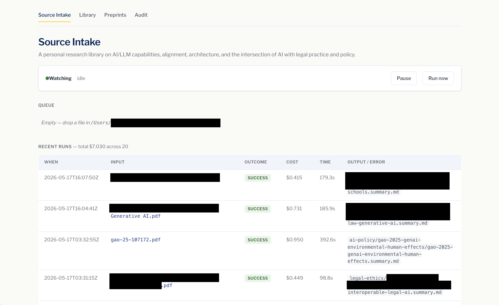
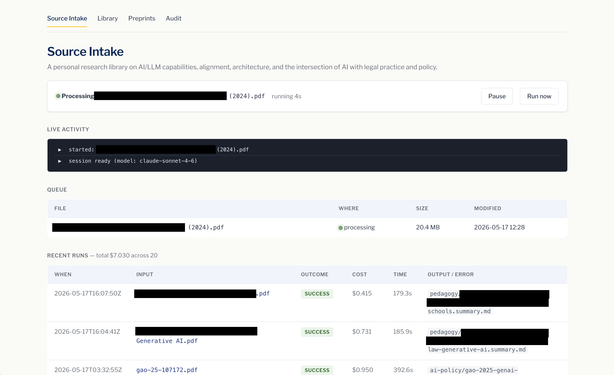
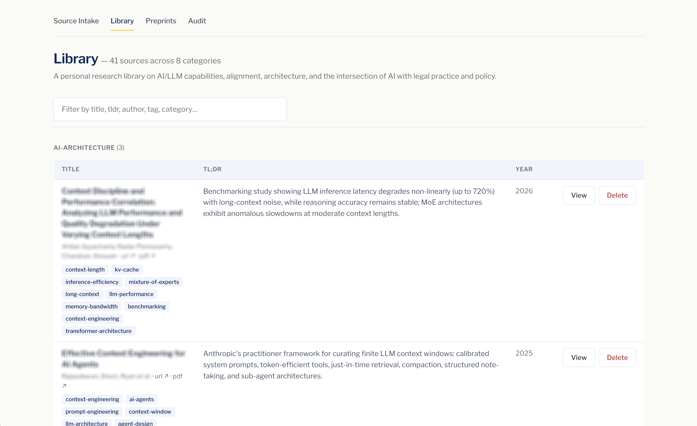
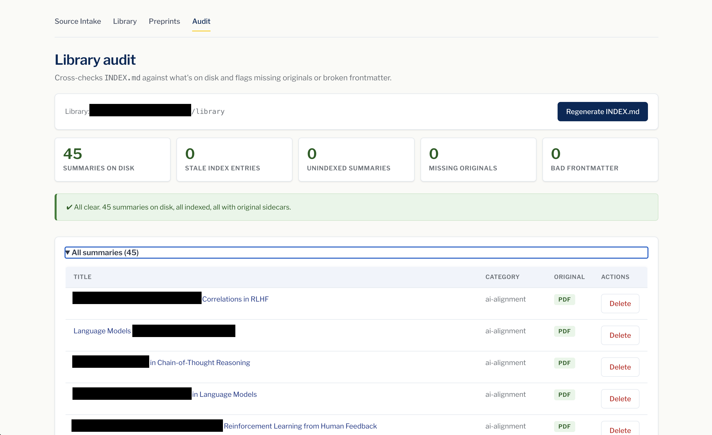
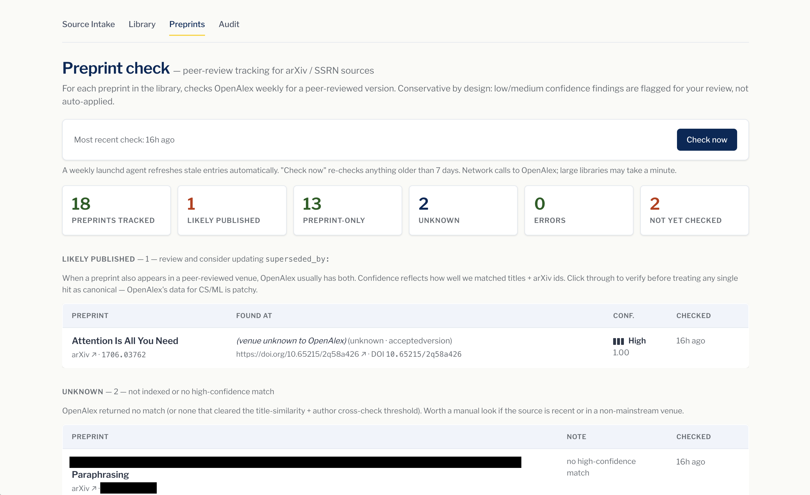

# Source-Intake Agent

> A macOS tool that turns a folder of PDFs into a searchable research library — automatically.



## What this is

Drop a research paper, an article URL, or a saved webpage into a folder on
your Mac. In the background, Claude Code reads it, writes a structured
summary, and files everything into a personal library — organized, tagged,
and searchable. You configure once what kind of library you're building
(research papers, recipes, news clippings, climate policy — whatever), and
the LLM adapts its category choices, tag vocabulary, section framing, and
tone to fit.

Everything runs locally on your own machine. Your library lives in a folder
you own: browse it in Finder, edit summaries in any text editor, and keep
it forever even if you stop using this tool.

## How it works

**1. Drop a file in your inbox folder.**

PDFs work directly. URLs can be dropped as a plain `.txt` file. Saved
webpages (`.md` or `.html`) work too. You can do this from Finder, the
command line, a browser's "Save as," or any other way you'd put a file in a
folder — the tool doesn't care how it gets there.

**2. The agent reads it in the background.**



No clicking around. A folder watcher notices the new file and the agent
starts automatically. Watch progress in the dashboard at
`http://localhost:7341`, or just walk away — runs typically take a few
minutes per source and the dashboard remembers everything.

**3. A structured summary lands in your library.**



Each source gets its own folder with a markdown summary, the original PDF,
and metadata you can search by title, author, tag, category, or TL;DR.
Institutional authors (think *U.S. Government Accountability Office* or
*OECD*) are recognized as organizations and displayed in full.


Summaries are plain markdown with structured YAML frontmatter — readable on
their own, but also queryable as data. Nothing is hidden in a proprietary
database; if you stop using the tool tomorrow, you keep every file.

**4. Built-in audit and preprint tools keep things tidy.**



The audit page catches stale index entries, summaries missing their original
PDF, and unparseable frontmatter — useful when you've been editing the
library by hand or moving things around.



For academic libraries, a weekly check against [OpenAlex](https://openalex.org)
flags arXiv and SSRN preprints that have since appeared in a peer-reviewed
venue. Confidence is shown as a signal-bar meter — the tool surfaces matches
for your review and never overwrites your summaries automatically.

## Who is this for?

- **Researchers and academics** building a personal knowledge base from papers.
- **Writers and analysts** who collect articles and reports and want them summarized and searchable.
- **Hobbyists with a folder of PDFs** they wish they could actually find things in.
- **Anyone curious about agent automation** — a small, readable example of headless Claude Code wired into a real workflow.

If you're on macOS, comfortable running a one-time install script in your
terminal, and have an [Anthropic API key](https://docs.anthropic.com/en/api/getting-started),
you're set.

---

> **You choose where the library and inbox live, and what they're for.**
> Defaults are `~/source-library`, `~/source-library-inbox`, and a generic
> domain — but you'll almost certainly want to override them via a local
> `.env` (gitignored). See **Configure** below.

## Architecture

```
$INBOX/                                ← drop files here
  ├── .staged/                         (worker-managed working copies)
  └── _failed/                         (quarantined inputs + .log sidecars)

~/.config/claude-source-intake/
  ├── env                              (your ANTHROPIC_API_KEY, mode 0600)
  ├── prompt.txt                       (autonomy prompt — editable from UI)
  ├── runs.jsonl                       (append-only run history)
  ├── current-run.log, last-run.log    (claude stream-json output)
  └── venv/                            (Flask + PyYAML)

~/Library/Scripts/                     (deployed by install.sh)
  ├── claude-source-intake.sh
  ├── claude-source-intake-ui.py
  ├── claude-source-intake-regen-index.py
  ├── claude-source-intake-check-preprints.py
  └── claude-source-intake-detect-promotion.py

~/Library/LaunchAgents/
  ├── <prefix>.claude-source-intake.plist                 (WatchPaths + 5-min interval)
  ├── <prefix>.claude-source-intake-ui.plist              (dashboard server)
  └── <prefix>.claude-source-intake-preprint-check.plist  (weekly cron)
```

**Flow per file drop:**

1. launchd's `WatchPaths` on the inbox fires the worker (a 5-minute
   `StartInterval` backstop catches files whose directory event was missed,
   and the worker re-scans the inbox after each pass so files dropped while
   a run is in progress are picked up by the same run).
2. **Dedup check** (before staging): SHA-256 the input bytes (and, for
   `.txt`/`.url` inputs, extract the URL). Compare against every existing
   summary's `source_hash:` and `url:` frontmatter fields. On match: move the
   input to `_duplicate/` with a `.log` listing the matched summary, append a
   `duplicate` entry to `runs.jsonl`, **skip claude entirely** (no cost), and
   continue.
3. Otherwise: stage the file into `.staged/<uuid>-<basename>` (atomic).
4. Invoke `claude -p "<autonomy prompt>" --model claude-sonnet-4-6
   --permission-mode acceptEdits --output-format stream-json --verbose`,
   redirecting output to `current-run.log` so the dashboard can tail it live.
5. On success (claude exit 0 + a new `*.summary.md` appears under a category
   folder): inject `source_hash: "<sha256>"` into each new summary's
   frontmatter (hashing that summary's own filed `.pdf`/`.snapshot.md`, not
   the run's input — a digest input can produce several summaries), delete
   the staged file, regenerate `INDEX.md`, append a JSONL entry with cost +
   duration to `runs.jsonl`.
6. On failure: move the staged file to `_failed/` with its log next to it.
   Any summary folders the failed run already created are quarantined to
   `_failed/_partial/` so a half-written summary can't dedup-block a retry.
7. If the worker is killed mid-run (reboot, force-quit), the next tick
   recovers the staged input back to the inbox automatically.

## Prerequisites

- macOS (uses launchd, `launchctl`, `plutil`, `open`)
- [Claude Code CLI](https://github.com/anthropics/claude-code) on `PATH`
- `python3` (system or homebrew)
- An Anthropic API key

## Install

```sh
git clone <this repo> ~/Developer/source-intake-agent
cd ~/Developer/source-intake-agent
cp .env.example .env       # then edit .env with your real LIBRARY / INBOX
./install.sh               # or `./install.sh --link` (see Sync below)
```

Then set your API key (kept out of git, mode 0600):

```sh
echo 'ANTHROPIC_API_KEY=sk-ant-...' > ~/.config/claude-source-intake/env
chmod 600 ~/.config/claude-source-intake/env
```

Open <http://localhost:7341> to see the dashboard.

## Configure

Configuration is layered — later sources override earlier ones:

1. **Defaults** (placeholders shown below)
2. **`.env` at the repo root** — your personal config; gitignored
3. **Environment variables passed on the command line** to `install.sh`

| Var              | Default                       | Purpose                                       |
| ---------------- | ----------------------------- | --------------------------------------------- |
| `DOMAIN`         | *generic library*             | Free-text description of the library's domain |
| `LIBRARY`        | `~/source-library`            | Where summaries are filed                     |
| `INBOX`          | `~/source-library-inbox`      | Watched folder                                |
| `LABEL_PREFIX`   | `com.user`                    | Reverse-DNS prefix for plist labels           |
| `CLAUDE_BIN`     | `$(command -v claude)`        | Path to the `claude` CLI binary               |
| `CATEGORY_ORDER` | *(empty — alphabetical)*      | Comma-separated preferred sort for categories |
| `OPENALEX_EMAIL` | *(empty — anonymous)*         | Opts the weekly preprint check into OpenAlex's polite pool |
| `DASHBOARD_EXTRA_ORIGINS` | *(empty)*            | Comma-separated extra browser origins permitted to POST to the dashboard (CSRF allowlist); 127.0.0.1 and localhost are always allowed |

Recommended workflow: keep your real paths in `.env` (which is `.gitignore`d)
so they never leak into commit history.

```sh
cat > .env <<'EOF'
DOMAIN="AI/LLM research papers and policy reports."
LIBRARY=~/path/to/your/library
INBOX=~/path/to/your/inbox
LABEL_PREFIX=com.your-handle
EOF
./install.sh --link
```

### Domain customization

The `DOMAIN` field is the single most important setting after paths. It's
free text — a sentence or two describing what kind of sources this library
collects. The worker substitutes it into the autonomy prompt at run time so
claude has appropriate context for category choices, tag vocabulary, section
framing, and tone.

A specific domain produces a more useful library. Examples:

| Domain | Effect on intake |
|---|---|
| `"AI/LLM research papers and policy reports."` | Scholarly framing — Methodology sections, formal citations, technical tags |
| `"Recipes from cookbooks, blogs, and magazines for home cooks."` | Sections like ingredients, technique notes, dietary tags; no Methodology |
| `"Tech industry news articles and analyst reports from 2024 onward."` | Article framing — main argument, key takeaways, source-credibility note |
| `"Climate policy briefings and academic papers on energy transition."` | Mixed scholarly/policy — adapts per source |
| `"Personal reading notes from non-fiction across the humanities."` | Looser, more interpretive; chapter-level categories |

The taxonomy (category folders) **emerges organically** as you add sources —
claude picks an appropriate category for each one, creating a new folder
when no existing one fits. After a handful of intakes you'll see your
domain's natural categories take shape. If you want a head start, create a
few empty category folders manually before processing your first file.

You can change `DOMAIN` later by editing `.env` and re-running `./install.sh`
(re-renders the launchd plist with the new value); the change applies on the
next file drop.

`install.sh` is idempotent — re-running it refreshes the deployed scripts and
reloads the launchd agents without touching your API key, run history, or
custom prompt. It also tightens permissions on `$CONFIG/env` to `0600` if
they've drifted.

### Runtime tunables

These don't affect install; the worker reads them from `$CONFIG/env` (or the
launchd plist `EnvironmentVariables`). Defaults are sensible — override only if
you have a reason.

| Var | Default | Effect |
| --- | --- | --- |
| `MODEL` | `claude-sonnet-4-6` | `--model` passed to `claude`. Bump when a newer model ships. |
| `CLAUDE_TIMEOUT` | `900` | Wall-clock seconds before the watchdog kills a hung `claude` (SIGTERM, then SIGKILL 3s later). Normalized to exit 124. |
| `MAX_RETRIES` | `2` | Number of retries after the first attempt (so up to 3 attempts). Exit 127 (binary missing) skips retries. |
| `RETRY_BACKOFF` | `30` | Seconds between retries. |
| `RUNS_LOG_MAX_BYTES` | `5242880` | Rotate `runs.jsonl` past 5 MB; previous file becomes `runs.jsonl.1`. |
| `RUN_LOG_KEEP` | `50` | Per-iteration stream-json archives kept under `$CONFIG/run-logs/`. |
| `DASHBOARD_PORT` | `7341` | Localhost port the dashboard binds to. Set it in `.env` and re-run `./install.sh` (it's rendered into the dashboard plist). |
| `PREPRINT_REFRESH_DAYS` | `7` | Preprint cache entries older than this are re-checked. Set it in `.env` and re-run `./install.sh` (rendered into the dashboard + cron plists). |
| `PREPRINT_PROMOTION_MODE` | `auto` | How the worker handles a PDF that looks like the published version of a tracked preprint. `auto` archives the preprint and intakes the published PDF into its category slot. `stage` routes the PDF to `_promoted/_pending/` for manual review. `off` disables detection. |

## Keeping the repo and the running system in sync

The deployed scripts live at `~/Library/Scripts/` and the launchd plists at
`~/Library/LaunchAgents/`. Two ways to keep them in lockstep with this repo:

### Option A — copy mode (default)

Edit files in the repo, then `./install.sh` to re-deploy. Standard, portable,
safe to delete the repo after install.

```sh
vim scripts/dashboard.py
./install.sh                    # redeploys + reloads launchd
```

### Option B — symlink mode (`--link`)

The deployed scripts become symlinks pointing back into this repo. Edits in
`scripts/*.{sh,py}` are live immediately on the next invocation. **The repo is
the single source of truth — don't move or delete it.**

```sh
./install.sh --link             # one-time setup
# from now on:
vim scripts/dashboard.py
launchctl kickstart -k gui/$(id -u)/<LABEL_PREFIX>.claude-source-intake-ui
                                # bounce dashboard to pick up Python changes
```

What needs reloading after each kind of edit:

| You edit | Action needed |
|---|---|
| `scripts/worker.sh` | nothing — invoked fresh per file drop |
| `scripts/dashboard.py` | `launchctl kickstart -k gui/$(id -u)/<prefix>.claude-source-intake-ui` |
| `scripts/regen-index.py` | nothing — invoked fresh after each successful run |
| `scripts/check-preprints.py` | nothing — invoked fresh by cron / dashboard |
| `scripts/detect-promotion.py` | nothing — invoked fresh by the worker on each PDF drop |
| `launchd/*.plist.template` | re-run `./install.sh` (re-renders + reloads agents) |
| `config/prompt.txt` | doesn't auto-propagate — see note below |
| `requirements.txt` | re-run `./install.sh` (re-runs pip install) |
| `.env` | re-run `./install.sh` (re-renders plists with new values) |

**Note on the prompt:** `~/.config/claude-source-intake/prompt.txt` is a
*user-customizable* file (editable from the dashboard's Settings panel) and is
deliberately *not* symlinked or overwritten on re-install. To start fresh from
the repo's template, delete the file and run `./install.sh`.

### Verifying which mode you're in

```sh
ls -l ~/Library/Scripts/claude-source-intake.sh
# symlink (→ <repo>/scripts/worker.sh)   ← --link mode
# regular file with byte count           ← copy mode
```

## Day-to-day use

- **Drop a file** in your inbox folder (PDF, `.txt` with a URL, `.md`, or
  `.html`). Watch progress at <http://localhost:7341>.
- **Dashboard pages:**
  - `/` — live status, queue, recent runs (cost + duration), failed items,
    last-run replay, prompt editor.
  - `/library` — searchable, sortable browser of all sources with click-to-open
    and a per-row **Delete** button (removes the `<category>/<slug>/` folder and
    regenerates `INDEX.md`).
  - `/audit` — cross-checks `INDEX.md` against what's on disk. Catches stale
    INDEX entries (folder deleted by hand but still linked), unindexed
    summaries, summaries missing their original sidecar (`.pdf` / `.snapshot.md`),
    and unparseable frontmatter. Has a one-click **Regenerate INDEX.md** button
    to fix the stale-index case.
  - `/preprints` — surfaces arXiv / SSRN sources that have since appeared in a
    peer-reviewed venue. A weekly launchd agent refreshes the cache in the
    background; the **Check now** button forces a re-check. See
    [Preprint publication tracking](#preprint-publication-tracking) below.
- **Pause/resume the watcher** from the dashboard, or:
  ```sh
  touch ~/.config/claude-source-intake/paused      # pause
  rm    ~/.config/claude-source-intake/paused      # resume
  ```
- **Tail logs from a terminal** (parallel to the dashboard view):
  ```sh
  tail -f ~/.config/claude-source-intake/current-run.log
  tail -f /tmp/claude-source-intake.out.log
  ```

## Customizing the autonomy prompt

The prompt at `~/.config/claude-source-intake/prompt.txt` is what gets passed
to `claude -p` for each run. Edit it from the dashboard's Settings panel or
directly. The token `<STAGED_PATH>` is substituted with the staged file's path
at run time. On first install, `__LIBRARY__` in the template is substituted
with your configured library path.

## Deduplication

The worker skips files that duplicate something already in the library, so
accidental re-drops don't cost time or money:

- **Byte-identical PDFs/MDs/HTMLs** are matched by `source_hash:` (SHA-256)
- **`.txt`/`.url` inputs** are matched by `url:` against existing summaries,
  after conservative normalization on both sides (case-insensitive host,
  trailing slash, `utm_*`-style tracking params, fragments)

A duplicate lands in `_duplicate/` with a `.log` sidecar identifying the
matched summary; you'll also see it in the dashboard's Duplicates section.
**No claude invocation, $0 cost** for dedup-rejected files.

To force re-processing of a file you really do want to re-summarize: delete
the matched summary first, then move the file from `_duplicate/` back to the
inbox.

**Backfill (missing originals):** if the matched summary is *missing* its
source artifact (`<slug>.pdf` / `<slug>.snapshot.md` deleted or never filed),
a matching drop is not a duplicate — the worker files it into the summary's
folder as the missing original and force-refreshes `source_hash:`, again with
no claude invocation. Besides hash/URL matches, the worker recognizes the
original by filename-vs-slug similarity, and for PDFs by the embedded Title
metadata and first-page text matched against the summary's `title:` — so a
re-downloaded `3582269.3615599.pdf` finds its summary even though the
filename says nothing about the paper.

## Preprint publication tracking

Many sources start as preprints on arXiv or SSRN and later appear in a
peer-reviewed venue. The dashboard's `/preprints` page surfaces that
promotion so you can decide whether to swap the source or fill in
`superseded_by:`.

**What it does:**

- Walks the library for summaries whose `url:` lives on `arxiv.org` or
  `ssrn.com`, or whose `source_type:` is `preprint` (also catches
  `publication:` strings that start with "arXiv" / "SSRN" / "preprint").
- For each one, queries [OpenAlex](https://openalex.org) by title (with an
  arXiv-id cross-validation when available) and inspects the matched work's
  `locations[]` for a non-repository, non-preprint-server version.
- Caches results in `~/.config/claude-source-intake/preprint-checks.json`.
  Entries are refreshed when older than 7 days (override:
  `PREPRINT_REFRESH_DAYS`).

**How to use it:**

- The `/preprints` page lists results in four buckets — *Likely published*,
  *Preprint-only*, *Unknown*, *Errors* — with a confidence rating on each
  published hit. A weekly launchd cron (Monday 03:15) keeps the cache fresh
  in the background. Click **Check now** to force an immediate re-check.
- Findings are **never auto-written** to summary frontmatter. OpenAlex's
  coverage of CS/ML is patchy and title-search has inherent false-positive
  risk, so the page surfaces matches for your review — you decide whether to
  update `superseded_by:` or replace the source entirely. See *Replacing a
  preprint with its published version* below for the replace-in-place flow.

**Be a good OpenAlex citizen:** set `OPENALEX_EMAIL=you@example.com` in
`.env`. That opts the check into OpenAlex's "polite pool" with a higher rate
limit and friendlier 503 behavior. Without it, the API still works but is
treated as anonymous and may throttle on libraries with many preprints.

You can also run the check manually:

```sh
LIBRARY_PATH=$LIBRARY ~/.config/claude-source-intake/venv/bin/python \
  scripts/check-preprints.py            # refresh stale entries
  # --force                             # re-check everything
  # --rel-path foo/bar.summary.md       # check one source by path
```

### Replacing a preprint with its published version

When `/preprints` flags a "Likely published" hit and you've verified it's the
same paper, drop the published-version PDF into the inbox — the worker
auto-detects the promotion and swaps it in.

**Workflow:**

1. On `/preprints`, click the DOI / venue link for the candidate and confirm
   it's the same paper.
2. Download the published-version PDF from the publisher (or wherever you have
   access).
3. Move that PDF into the inbox like any other source.
4. The worker tick:
   - Extracts the DOI from the PDF (metadata + first-page text) and matches it
     against the `preprint-checks.json` cache. A high-similarity title match
     against the cached `published_title` is the fallback when no DOI can be
     extracted.
   - Archives the preprint's summary, sidecar PDF, and snapshot to
     `$INBOX/_promoted/<timestamp>-<slug>/` along with a `promotion.txt` note
     (recoverable; mirrors the `_failed/` and `_duplicate/` pattern).
   - Removes the preprint's entry from `preprint-checks.json`.
   - Runs normal intake on the published PDF, then moves the produced summary
     and filed PDF into the preprint's original category folder so it inherits
     that library slot.
   - Logs the iteration to `runs.jsonl` with `outcome: "promoted"`.
5. `INDEX.md` regenerates with the new entry; `/preprints` no longer lists the
   old summary.

**Failure safety:** if intake of the published PDF fails after the preprint is
archived, the worker restores the preprint from the archive directory
automatically (the failed PDF goes to `_failed/` for retry).

**Tuning:** set `PREPRINT_PROMOTION_MODE=stage` to route promotion-candidate
PDFs to `$INBOX/_promoted/_pending/` for manual review instead of acting
automatically, or `PREPRINT_PROMOTION_MODE=off` to disable detection entirely
and treat such PDFs as fresh sources.

### Backfilling existing summaries

If you're upgrading an installation that pre-dates dedup, run once to add
`source_hash:` to the YAML frontmatter of every existing summary:

```sh
LIBRARY_PATH=$LIBRARY ~/.config/claude-source-intake/venv/bin/python \
  scripts/backfill-hashes.py
```

The script walks the library, hashes each summary's sibling `<slug>.pdf` (or
`.snapshot.md`), and inserts the hash into the frontmatter. Idempotent — safe
to re-run.

If your library has institutional sources (GAO, ABA, OECD, etc.) filed
before the library page learned to render them in full, also run:

```sh
LIBRARY_PATH=$LIBRARY ~/.config/claude-source-intake/venv/bin/python \
  scripts/migrate-institutional-authors.py            # dry-run
  # --apply                                           # actually write changes
```

The script copies `publication:` into `authors:` for summaries where the
publication is recognized as an organization and `authors:` is empty.
Defaults to dry-run; idempotent.

## Library schema

Each summary has YAML frontmatter; the auto-generated `INDEX.md` is built from
these fields:

```yaml
---
title: "..."
authors:
  - "Last, First"
source_type: paper
publication: "..."
date: "YYYY-MM-DD"
url: "..."
retrieved: "YYYY-MM-DD"
snapshot: false
category: "your-category"
tldr: "One sentence (~25 words) that stands alone."
source_hash: "<sha256 of the source file>"   # auto-injected by worker; used for dedup
tags:
  - tag1
currency_check: "YYYY-MM-DD"
superseded_by: ""
---
```

The `tldr` field powers the Tl;dr column in `INDEX.md` and the dashboard's
Library page. The prompt requires it on every intake.

## Troubleshooting

| Symptom | Likely cause | Fix |
|---|---|---|
| Worker fails with `Not logged in · Please run /login` | launchd-spawned `claude` can't see your interactive auth | Add `ANTHROPIC_API_KEY=...` to `~/.config/claude-source-intake/env` (mode 0600) |
| File dropped but nothing happens | mtime guard (5s) is filtering a "still being written" file | Will fire on next event; or click "Run now" in the dashboard |
| Dashboard not at localhost:7341 | Port collision or agent crashed | `tail /tmp/claude-source-intake-ui.err.log`; `launchctl kickstart -k gui/$(id -u)/<prefix>.claude-source-intake-ui` |
| Library page shows zero sources | `LIBRARY` env not set in plist, or summaries lack `---` frontmatter | Re-run `install.sh`; verify summaries have YAML frontmatter |
| `INDEX.md` won't regenerate | PyYAML missing from venv | `~/.config/claude-source-intake/venv/bin/pip install -r requirements.txt` |
| Run keeps timing out at the `CLAUDE_TIMEOUT` ceiling | Large PDF or slow upstream | Raise `CLAUDE_TIMEOUT` in `$CONFIG/env` (e.g. `CLAUDE_TIMEOUT=1800`). |
| Dashboard rejects POSTs with `403 cross-origin request blocked` | A browser extension or external site is hitting localhost | Expected — the CSRF guard blocks it. Use the dashboard directly. |
| Stale `/tmp/claude-source-intake.lock` blocks all runs | Worker was killed before its trap fired | The next worker invocation detects the dead holder PID and reclaims automatically. To force-clear: `rm -rf /tmp/claude-source-intake.lock`. |

Logs to check:

- `/tmp/claude-source-intake.out.log` — worker stdout (per-file processing)
- `/tmp/claude-source-intake.err.log` — worker stderr
- `/tmp/claude-source-intake-ui.err.log` — Flask + binding info
- `~/.config/claude-source-intake/runs.jsonl` — structured run history
- `~/.config/claude-source-intake/last-run.log` — last `claude` invocation's
  stream-json output

## Uninstall

```sh
./uninstall.sh           # removes launchd agents + deployed files; keeps state
./uninstall.sh --purge   # also wipes ~/.config/claude-source-intake (api key,
                         # history, prompt, venv). Library/inbox NEVER touched.
```

## Repo layout

```
source-intake-agent/
├── README.md
├── install.sh
├── uninstall.sh
├── requirements.txt
├── .env.example                 ← copy to .env (gitignored) and customize
├── .gitignore
├── scripts/
│   ├── worker.sh
│   ├── dashboard.py
│   ├── regen-index.py
│   ├── check-preprints.py    ← OpenAlex lookup for arXiv/SSRN promotion
│   ├── detect-promotion.py   ← worker hook: match dropped PDF to a tracked preprint
│   ├── backfill-hashes.py    ← one-shot: add source_hash to existing summaries
│   └── migrate-institutional-authors.py  ← one-shot: normalize org-authored summaries
├── launchd/
│   ├── worker.plist.template
│   ├── dashboard.plist.template
│   └── preprint-check.plist.template      (weekly cron, Mon 03:15)
└── config/
    └── prompt.txt               ← default autonomy prompt; __LIBRARY__ token
                                    is substituted on first install
```

## License

[MIT](LICENSE) — do what you like, no warranty.

## Found a problem or have a question?

Open an issue: <https://github.com/dskemp/source-intake-agent/issues/new/choose>.
See [CONTRIBUTING.md](CONTRIBUTING.md) for templates and guidelines.
